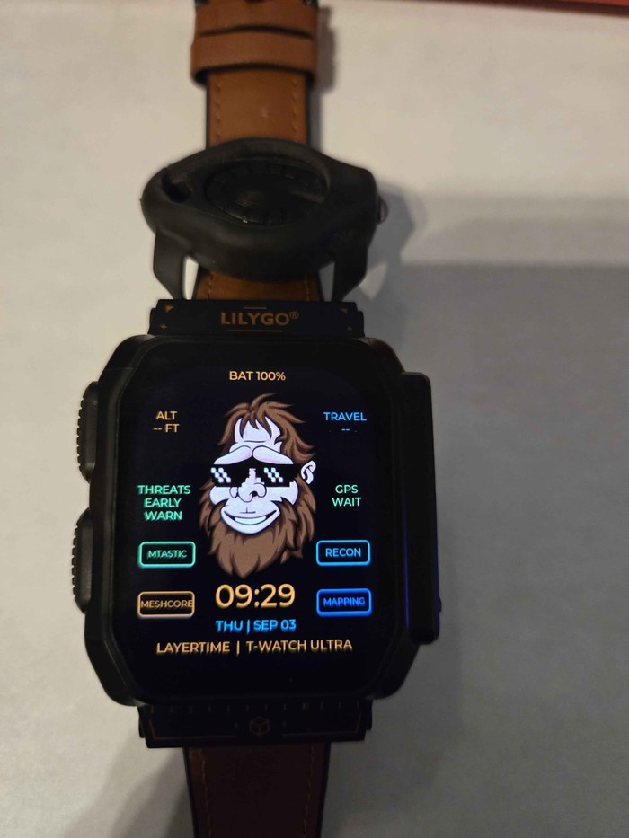

  

<h1 align="center">🌟 LayerTime 🌟</h1>

Counter-intrusion field firmware for the LilyGo T-Watch Ultra

**Counter-intrusion and resilient communications firmware for the LILYGO T-Watch Ultra**

## Why this exists

A few years ago, I was reviewing my home security cameras when I discovered a camera feed from inside my bedroom. I had not installed it. No one in my household knew it existed.

That left me with two uncomfortable questions:

**How would I know if someone were using wireless technology to monitor or attack my home? And if normal communications failed, how would I reach anyone?**

At the same time, I wanted a field watch without the health tracking, subscriptions, and lifestyle features built into most commercial smartwatches. I needed something focused on awareness, privacy, navigation, and resilient communications.

So I built LayerTime.

LayerTime transforms the LILYGO T-Watch Ultra into a wearable counter-intrusion and field-communications platform. It passively monitors nearby Wi-Fi and Bluetooth activity for indicators associated with surveillance equipment, tracking devices, and common wireless attack tools.

Depending on the available radio data, LayerTime can flag:

- Multiple SSIDs associated with the same transmitter, which may indicate evil-portal or Karma-style activity.
- Wi-Fi deauthentication frames.
- Nearby devices or radio signatures associated with Flock cameras, Pwnagotchi, Wi-Fi Pineapples, AirTags, Flipper Zero devices, and Meta smart glasses.

These detections are indicators, not proof of an attack. LayerTime gives the wearer information that consumer smartwatches ordinarily ignore.

When cellular and internet service are unavailable, LayerTime can also communicate over LoRa using either of two independent mesh ecosystems. The networks are intentionally separate and non-interoperable, giving the wearer an alternative when conventional communications cannot be trusted or simply do not work.

## What it does

### Passive threat detection (Recon)

No active transmission, injection, or association — LayerTime only listens.

- **Wi-Fi scan**: SSID, BSSID, RSSI, channel, security, sorted strongest-first.
- **BLE scan**: name, address, RSSI.
- **Activity monitoring**: passive channel-hopping across all US 2.4 GHz Wi-Fi channels, counting management/data/control frames and flagging deauth/disassociation activity in real time — source, RSSI, channel.
- **Dedicated detectors** for the specific tools and devices most associated with surveillance or intrusion: Deauth attacks, Pwnagotchi, MultiSSID rogue-AP patterns (evil portal/Karma), and Pineapple over Wi-Fi; Flock cameras, Flipper Zero, AirTag, and Meta smart glasses over BLE.
- **Early Warning**: an optional always-on background sweep across every detector above, running whether or not you have the Recon screen open, so a threat gets flagged the moment it appears rather than only when you go looking.
- **SD logging**: every new detection can be appended to a CSV log on the SD card automatically — a running, timestamped record of what's been detected around you.

### GPS

Live latitude/longitude, altitude, satellite count, HDOP, speed, and course over ground from the onboard GNSS, plus an in-page WGS84-to-UTM conversion — no map engine, no cell connection, no cloud dependency required.

### Dual mesh radios — MeshCore or Meshtastic, your call

The watch has one physical LoRa radio, and LayerTime can drive it as either of two independent mesh networks. They don't interoperate with each other, so which one you use comes down to who you need to reach:

- **MeshCore** — the original integration: public-channel chat, signed node adverts with your name and GPS position, a heard-node list. Kept in the tree and fully working.
- **Meshtastic** — a second, from-scratch implementation of the far more widely deployed Meshtastic protocol on its default US/LongFast public channel: node, telemetry, and position decoding, public-channel chat (send and receive), and optional identity broadcasting so others see your name instead of a raw node number.

Only one radio is active at a time — enabling one in Settings automatically disables the other — but switching between them takes one tap, no reboot required. Bring a group on MeshCore, or talk to the much larger population of Meshtastic users out there; either way, you're not dependent on cell towers to reach someone.

### SD card that fixes its own problems

A destructive, in-the-field format utility — available any time a card is inserted, whether it currently mounts or not. This exists for a specific, annoying reason: a card used with tools like Pwnagotchi or Ragnar comes back in a filesystem state that nothing else will read, normally forcing you to dig up an old digital camera to force a low-level reformat before the card is useful again. LayerTime's format path does that reformat itself — force-invalidating whatever's on the card and laying down a fresh, standard FAT filesystem — so the watch handles its own SD card without needing a second device. The same card also doubles as the Recon detection log.

### Everything else

- **Watch face** — time, date, battery, and one-tap launch buttons for MeshCore, Meshtastic, and Recon.
- **Settings** — brightness, clock format, units, GPS/mesh/recon toggles, date & time, and SD card tools, all persisted across reboots (with mesh radios deliberately defaulting to off every boot, so nothing keys up without you choosing to).
- **Power-aware display** — the AMOLED panel sleeps after 15 seconds of no touch input and wakes on a touch or a short crown press, while every background service (GPS, mesh, recon) keeps running underneath.

See [FEATURES.md](./FEATURES.md) for the full technical breakdown of every screen, setting, and radio parameter.

## Squatchify

LayerTime wears the owl by default — but you can **Squatchify** it.

  

Huge thanks to [The Talking Sasquach](https://talkingsasquach.com/) for the artwork, and for generously letting LayerTime ship it. His [SquachWatch-CYD](https://github.com/skizzophrenic/SquachWatch-CYD) project is also where a good deal of LayerTime's tracker and counter-surveillance research came from — the Flock, Axon, AirTag, Tile, SmartTag and drone signatures owe a lot to his work. Go look at what he builds.

**To Squatchify your own watch:** drop the artwork on the SD card at `/assets/squatch.png`, then turn on **SQUATCHIFY?** in Settings. That's it.

The image is read from the card rather than baked into the firmware, so you can swap it any time without reflashing. If the file isn't there, the Settings row reads `NO FILE` and the owl stays where it is — the default face never depends on removable storage.

Artwork requirements, if you want to make your own:

- **320 px tall** PNG (width is up to you; it is centred, not scaled).
- **8-bit palette, non-interlaced.**
- **No alpha channel.** Flatten it onto the background colour (`#050A0A`) first — an ARGB PNG composites to nothing on the RGB565 canvas and you will get a black box.

LVGL is built here without an image cache, so the PNG is decoded once into a canvas when the setting is switched on, rather than on every redraw.

## Hardware target

This project targets the **T-Watch Ultra** specifically (`default_envs = twatch_ultra` in `platformio.ini`), built on [LilyGoLib](https://github.com/Xinyuan-LilyGO/LilyGoLib) (ESP32-S3, SX1262 LoRa, AXP2101 PMU, MIA-M10Q GNSS). The `platformio.ini` also carries environments for T-Watch-S3, T-LoRa-Pager, and the LilyGoLib emulator targets inherited from the base template, but LayerTime's own screens and services are written against the Ultra's hardware and are not verified on the other boards.

## Build & flash (PlatformIO)

1. Install [Visual Studio Code](https://code.visualstudio.com/) and the `PlatformIO` extension (or use the PlatformIO Core CLI directly).
2. Open this project folder in VS Code and let PlatformIO fetch dependencies.
3. Confirm `default_envs = twatch_ultra` is uncommented in `platformio.ini` (it is, by default, in this repo).
4. Build, then upload over USB. If the port won't open ("Access is denied" on Windows), make sure nothing else — most commonly an open Serial Monitor — has it locked.
5. Use the Serial Monitor to watch boot/log output once flashed.

> [!IMPORTANT]
> ⚠️ USB port not enumerating, or the board won't enter download mode?
> See LilyGoLib's [T-Watch-Ultra download-mode notes](https://github.com/Xinyuan-LilyGO/LilyGoLib/blob/master/docs/lilygo-t-watch-ultra.md#t-watch-s3-ultra-enter-download-mode).
> For hardware diagnosis, LilyGo also provides stock [factory firmware](https://github.com/Xinyuan-LilyGO/LilyGoLib/tree/master/firmware).

## Project layout

- `src/app/WatchApp.*` — top-level app: wires every service and screen together, owns the settings-changed/mutual-exclusion logic.
- `src/services/` — hardware/protocol logic (Battery, Clock, GPS, Recon, MeshService (MeshCore), MeshtasticService, SdCardService, SettingsService).
- `src/ui/` — LVGL screens (WatchFace, GpsScreen, MeshScreen, MeshtasticScreen, ReconScreen, SettingsScreen).
- `src/model/` — shared state/settings structs (`AppSettings`, `WatchState`).
- `variants/lilygo_twatch_ultra/` — board pin definitions.
- `assets/` — source SVG assets (owl logo) and README imagery.

## Attribution

Based on LilyGo's [LilyGoLib-PlatformIO](https://github.com/Xinyuan-LilyGO/LilyGoLib) starter template.

Squatchy artwork by [The Talking Sasquach](https://talkingsasquach.com/), used with permission. Detector signature research adapted from his [SquachWatch-CYD](https://github.com/skizzophrenic/SquachWatch-CYD) (GPL-3.0); signature data only, no code.
